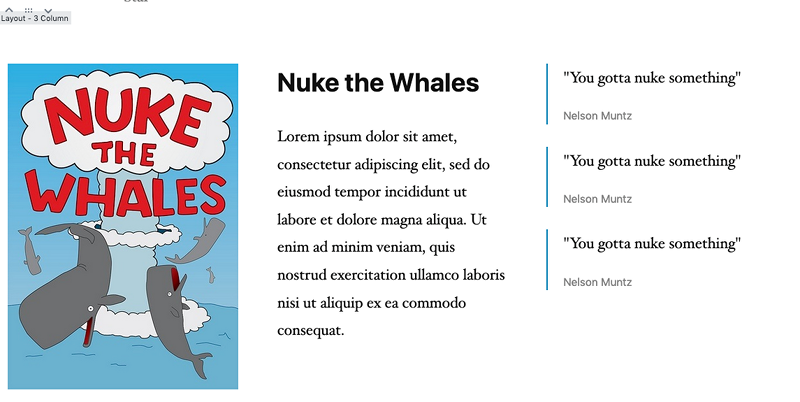

# Layout Blocks

This plugin provides a set of layout blocks for the WordPress editor (Gutenberg). The built-in set of layouts includes
1, 2, 3 and 4 columns layouts.

All you need to do is style the layouts in your theme. You can also optionally style the layout widgets in the wp-admin 
editor / Gutenberg. However, the plugin has some default styles which make them presentable for editors.

You can also extend this and create your own custom layouts. See the *Custom Layouts* section below for more information on how
to do this.

## Screenshot



## Build

The blocks are built using [create-guten-block](https://github.com/ahmadawais/create-guten-block). 
To work on the plugin's built in blocks you will need to run the following in the plugin directory.

```bash
npm install
npm start
```

## Custom Layouts

If you want to create a custom layout block, you'll want to start by copying one of the built in layout blocks. The layouts are built
on Gutenbergs `InnerBlock` which allows nesting of blocks.

Your JSX template should look something like this:

```es6
<div className={ props.className }>
	<InnerBlocks
		allowedBlocks={ [ 'tcc/column' ] }
		templateLock="insert"
		template={
			[
				[ 'tcc/column' ],
				[ 'tcc/column' ],
			]
		}
	/>
</div>
```

The `InnerBlock` should be restricted to the `tcc/column` block, which itself allows for nested widgets.
